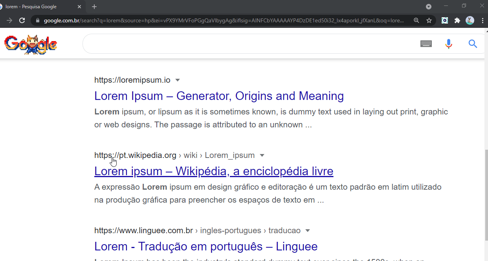
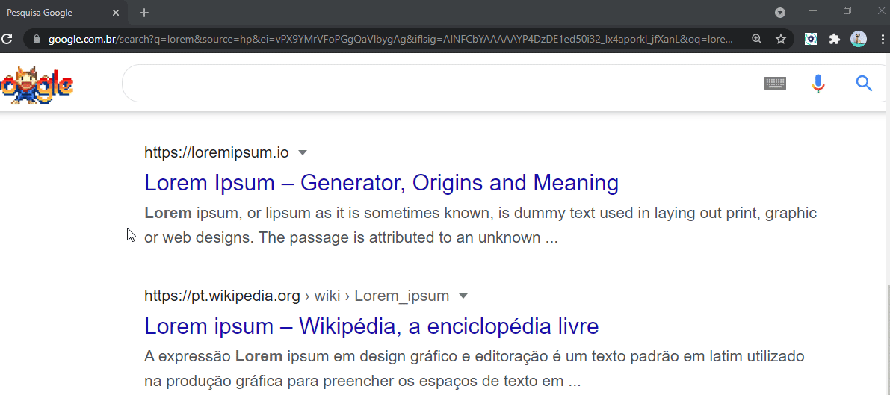

  

   
  
     
    
  
       

 <a href="#eye_speech_bubble-preview">Preview</a> •
 <a href="#information_source-about">About</a> • 
 <a href="#hammer_and_wrench-technologies">Technologies</a> • 
 <a href="#brain-applied-concepts">Concepts</a> • 
  <a href="#sparkles-features">Features</a> •
 <a href="#boy-author">Author</a> •
 <a href="#balance_scale-license">License</a>

---

## :information_source: About

Lately, after I discovered this fantastic world of extensions, any activity in my daily life can be automated by an extension. is an open door to a small project :).

This extension allows you to convert a selected snippet of text to various naming standards used in a developer's daily life.

---

## :eye_speech_bubble: **Preview**

Extension deployed at [Chrome Web Store](https://chrome.google.com/webstore/category/extensions) to see: [Click Here](https://chrome.google.com/webstore/detail/i%2B1-helper/pahefalbpfookcihpfalcoalamcbggme?hl=en&authuser=0)

It is possible to do the conversion in two ways

  
🎈 By Popup  

|                                🎈 Popup                                |
| :--------------------------------------------------------------------: |
| <kbd></kbd> |

  
🗯 Bt Context Menu 

|                         🗯 Context Menu                          |
| :-------------------------------------------------------------: |
| <kbd></kbd> |

  
---

## :hammer_and_wrench: **Technologies**

|                    :globe_with_meridians: FrontEnd                    |
| :-------------------------------------------------------------------: |
|      [HTML 5](https://developer.mozilla.org/en-US/docs/Web/HTML)      |
|       [CSS 3](https://developer.mozilla.org/en-US/docs/Web/CSS)       |
| [JavaScript](https://developer.mozilla.org/en-US/docs/Web/JavaScript) |

---

## :brain: **Applied Concepts**

|          :page_facing_up:          |
| :--------------------------------: |
|          DOM manipulation          |
| Element dataset property/attribute |
|    Chrome Background Script API    |
|         Chrome Storage API         |

---

## :sparkles: **Features**

|                              :page_facing_up:                               |
| :-------------------------------------------------------------------------: |
|                    Selected text conversion to lowercase                    |
|                    Selected text conversion to UPPERCASE                    |
|                   Selected text conversion to snake_case                    |
|                  Selected text conversion to CONSTANT_CASE                  |
|                    Selected text conversion to camelCase                    |
|                   Selected text conversion to PascalCase                    |
|                   Selected text conversion to kebab-case                    |
|                   Selected text conversion to Train-Case                    |
|                     Copy conversion result to clipboard                     |
| Conversion can be done by extension's popup or context menu (right-click) ) |

---

## :boy: **Author**

<a href="https://github.com/gleisonkz">
 
  
 <b>Gleison de Almeida</b>
</a>

Developed with ❤️ by Gleison Almeida 👋🏽 Contact me!

---

## :balance_scale: **License**

Copyright © 2021 [Gleison Almeida](https://github.com/gleisonkz). 
This project is licensed by [MIT](./LICENSE).

