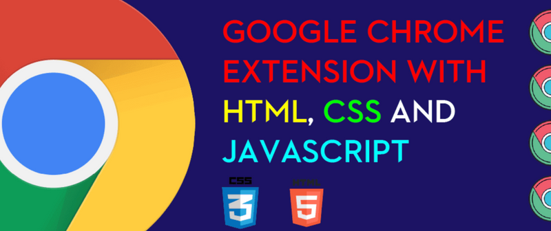
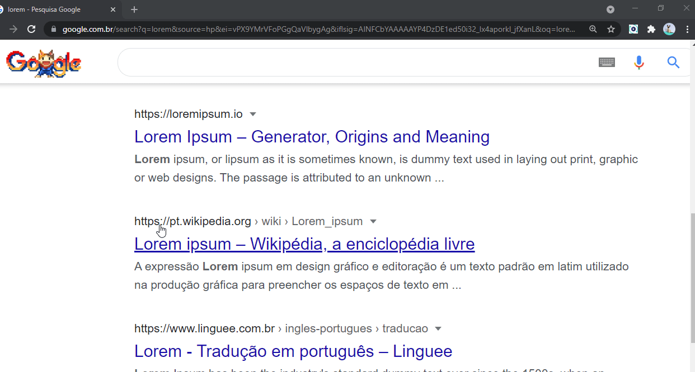
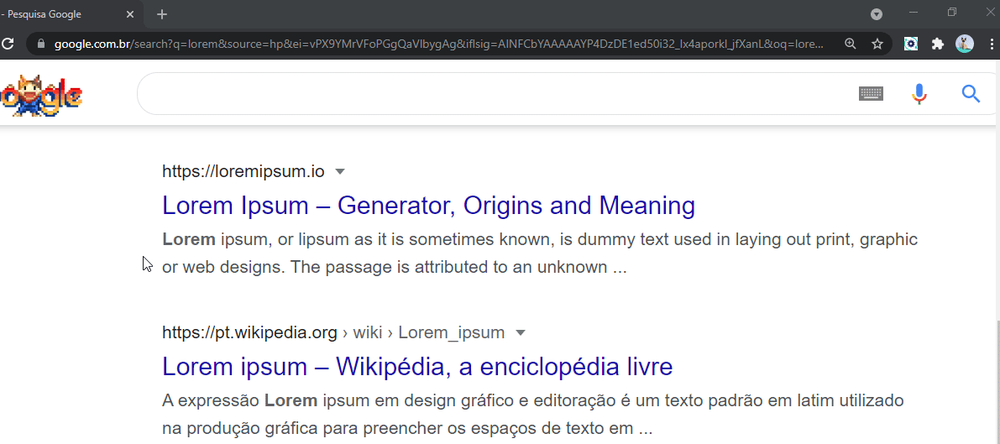
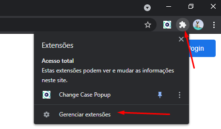
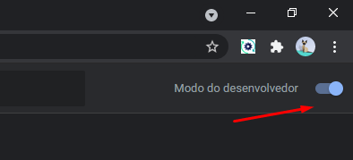
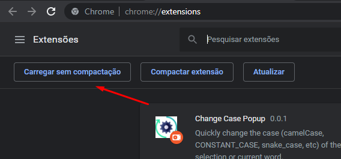

  
  
  
  

  

 
  
     
    
     
     
  

 <a href="#information_source-sobre">Sobre</a> •
 <a href="#eye_speech_bubble-visualizar">Visualizar</a> •
 <a href="#arrow_forward-executar">Executar</a> •
 <a href="#hammer_and_wrench-tecnologias">Tecnologias</a> • 
 <a href="#brain-conceitos-aplicados">Conceitos</a> •
 <a href="#sparkles-funcionalidades">Funcionalidades</a> •
 <a href="#boy-autor">Autor</a> •
 <a href="#balance_scale-licença">Licença</a>

---

## :information_source: Sobre

Ultimamente depois que descobri o fantástico mundo das extensões qualquer atividade no meu dia a dia que possa ser automatizado por uma extensão, é porta para um pequeno projeto 😃.

Essa extensão permite realizar a conversão de um trecho de texto selecionado para diversos padrões de nomenclatura utilizados no dia a dia de um desenvolvedor.

---

## :eye_speech_bubble: **Visualizar**

A extensão encontra-se publicada na Chrome Web Store e pode ser baixada por este link [aqui](https://chrome.google.com/webstore/detail/i%2B1-helper/pahefalbpfookcihpfalcoalamcbggme?hl=en&authuser=0)

É possível realizar a conversão de 2 formas

  
🎈 Via Popup  

|                                🎈 Popup                                |
| :--------------------------------------------------------------------: |
| <kbd></kbd> |

  
🗯 Via Menu de Contexto  

|                         🗯 Context Menu                          |
| :-------------------------------------------------------------: |
| <kbd></kbd> |

  
---

## :arrow_forward: **Executar**

Para executar esse projeto você precisa baixar este repositório, ir seguir os passos abaixo :

  
Passo a passo para carregar a extensão no navegador

|            :one: ir para o menu de gerenciador de extensões            |
| :--------------------------------------------------------------------: |
| <kbd></kbd> |

| :two: ative o modo de desenvolvedor clicando no botão toggle no canto superior direito. |
| :-------------------------------------------------------------------------------------: |
|         <kbd></kbd>          |

| :three: clique no botão carregar sem compactação e selecione o diretório do projeto. |
| :----------------------------------------------------------------------------------: |
|        <kbd></kbd>        |

---

## :hammer_and_wrench: **Tecnologias**

|                       :globe_with_meridians: FrontEnd                       |
| :-------------------------------------------------------------------------: |
|         [HTML 5](https://developer.mozilla.org/en-US/docs/Web/HTML)         |
|          [CSS 3](https://developer.mozilla.org/en-US/docs/Web/CSS)          |
|    [JavaScript](https://developer.mozilla.org/en-US/docs/Web/JavaScript)    |
| [Chrome API ](https://developer.chrome.com/docs/extensions/mv3/getstarted/) |

---

## :brain: **Conceitos Aplicados**

|          :page_facing_up:          |
| :--------------------------------: |
|          DOM manipulation          |
| Element dataset property/attribute |
|    Chrome Background Script API    |
|         Chrome Storage API         |

---

## :sparkles: **Funcionalidades**

|                           :page_facing_up:                           |
| :------------------------------------------------------------------: |
|             Converter trecho selecionado para lowercase              |
|             Converter trecho selecionado para UPPERCASE              |
|             Converter trecho selecionado para snake_case             |
|           Converter trecho selecionado para CONSTANT_CASE            |
|             Converter trecho selecionado para camelCase              |
|             Converter trecho selecionado para PascalCase             |
|             Converter trecho selecionado para kebab-case             |
|             Converter trecho selecionado para Train-Case             |
|            Copiar resultado da conversão para o clipboard            |
| Conversão pelo popup da extensão ou menu de contexto (botão direito) |

---

## :boy: **Autor**

<a href="https://github.com/gleisonkz">
 
  
 <b>Gleison de Almeida</b>
</a>

Desenvolvido com ❤️ por Gleison Almeida 👋🏽 Meus Contatos!

---

## :balance_scale: **Licença**

Copyright © 2021 [Gleison Almeida](https://github.com/gleisonkz). 
This project is licensed by [MIT](./LICENSE).

